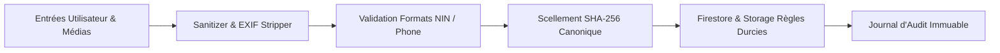

# Spécification Technique : Durcissement Global de la Sécurité (4 Piliers)

**Date :** 16 Septembre 2026  
**Statut :** En attente de validation utilisateur  
**Plateforme :** TELEMED SENEGAL V2  

---

## 1. Contexte & Objectif

Dans le cadre de la mise en conformité réglementaire (CDP Sénégal, HDS - Données de Santé), TELEMED SENEGAL V2 traite des données cliniques et médico-légales sensibles.

Ce document définit les 4 piliers de sécurisation applicative de bout en bout :
1. **Pilier 1 : Contrôle d'Accès & Sessions (RBAC / Admin)**
2. **Pilier 2 : Sanitisation XSS & Validation Stricte des Entrées Médicales**
3. **Pilier 3 : Protection des Médias & Nettoyage des Métadonnées EXIF (Anti-Leak GPS)**
4. **Pilier 4 : Scellement Cryptographique SHA-256 Déterministe & Traçabilité Médico-Légale**

---

## 2. Architecture & Détail des 4 Piliers

### 🔹 Pilier 1 : Cohérence & Durcissement du Contrôle d'Accès (RBAC)
- **Synchronisation Admin :** Définir la liste canonique des emails administrateurs reconnus (`pati.amouf@gmail.com`, `dr.thiam@telemed.sn` et `NEXT_PUBLIC_ADMIN_EMAIL`) dans `lib/utils/adminAuth.ts` et `AuthContext.tsx`.
- **Nettoyage Sécurisé de Session :** Lors de la déconnexion (`logout`), purger complètement les données locales (`localStorage`, session, cache de profil praticien).
- **Protection des Routes d'Administration :** Vérification stricte avec redirection automatique pour tout accès non autorisé à `/admin-thiam`.

### 🔹 Pilier 2 : Sanitisation XSS & Validation des Données Médicales
- **Module `lib/utils/sanitizer.ts` :**
  - `sanitizeText(input: string)` : Suppression/échappement des injections de code (`` sont correctement neutralisées.
3. **Test EXIF :** Vérifier qu'une photo de smartphone téléversée ne contient aucune trace de métadonnées GPS/EXIF.
4. **Test SHA-256 :** Vérifier la reproductibilité exacte du hash d'ordonnance entre client et serveur.
5. **Test Droits Admin :** Vérifier que seuls les emails autorisés accèdent aux fonctions d'administration.
