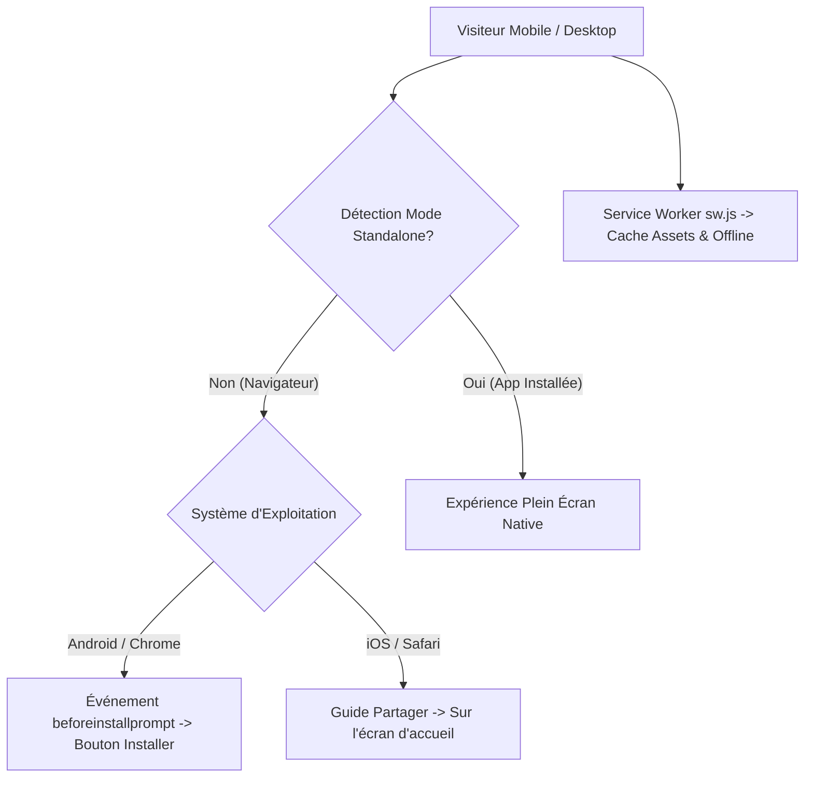

# Spécification Technique : Installation Mobile PWA (Progressive Web App)

**Date :** 16 Septembre 2026  
**Statut :** En attente de validation utilisateur  
**Plateforme :** TELEMED SENEGAL V2  

---

## 1. Contexte & Objectif

La majorité des patients et médecins au Sénégal accèdent à la télémédecine depuis des smartphones (Android et iPhone / iOS) sous des conditions de réseau variables (4G, 3G, Wi-Fi).

L'objectif de cette fonctionnalité est de transformer **TELEMED SENEGAL V2** en une **Progressive Web App (PWA)** complète, permettant :
1. **L'installation en 1 clic** sur l'écran d'accueil des smartphones (Android & iOS) comme une application native sans passer par le Play Store ou l'App Store.
2. **Un affichage plein écran natif** (mode `standalone`, sans barre d'adresse du navigateur).
3. **Le support hors-ligne (Service Worker)** pour les assets statiques et la consultation des ordonnances déjà chargées.
4. **Une bannière d'installation intelligente** adaptative (déclenchement natif sur Android, guide pas-à-pas illustré sur iPhone/Safari).

---

## 2. Architecture & Composants

### 2.1 Manifest Web App (`public/manifest.json`)
- Métadonnées complètes de l'application :
  - `name` : `TELEMED SENEGAL • Télémédecine & Santé`
  - `short_name` : `TéléMed SN`
  - `start_url` : `/`
  - `display` : `standalone`
  - `theme_color` : `#3B82F6`
  - `background_color` : `#0B132B`
  - `icons` : Ensemble d'icônes 192x192, 512x512 et maskable.

### 2.2 Service Worker (`public/sw.js`)
- Gestion du cycle de vie (`install`, `activate`, `fetch`).
- Stratégie de mise en cache **Cache-First** pour les assets statiques et **Network-First avec Fallback** pour les pages de consultation et ordonnances.

### 2.3 En-têtes & Métadonnées Next.js (`app/layout.tsx` & `next.config.mjs`)
- Ajout des balises `<meta>` et `<link>` pour Apple iOS (`apple-mobile-web-app-capable`, `apple-touch-icon`, `status-bar-style`).
- Mise à jour de la politique de sécurité (CSP) pour autoriser les Service Workers (`worker-src 'self'`).

### 2.4 Composant UI `PWAInstallBanner.tsx`
- Composant React flottant élégant en bas d'écran (Glassmorphism, animations subtiles avec Lucide icons).
- Bouton interactif pour déclencher le prompt d'installation officiel sur Android.
- Mini-modale explicative avec icônes Safari pour les utilisateurs iPhone.
- Mémorisation du refus utilisateur (`localStorage`) pour ne pas être intrusif.

---

## 3. Fichiers Concernés

| Fichier | Nature | Description |
|---|---|---|
| `public/manifest.json` | **[NOUVEAU]** | Manifest officiel PWA avec configuration standalone |
| `public/sw.js` | **[NOUVEAU]** | Service Worker pour mise en cache et mode hors-ligne |
| `public/icons/*` | **[NOUVEAU]** | Icônes d'application médicales (192px, 512px, SVG) |
| `components/ui/PWAInstallBanner.tsx` | **[NOUVEAU]** | Bannière adaptative d'installation Android & iOS |
| `app/layout.tsx` | **[MODIFIÉ]** | Métadonnées PWA, liens manifest et enregistrement Service Worker |
| `next.config.mjs` | **[MODIFIÉ]** | CSP mise à jour pour `worker-src 'self'` |

---

## 4. Critères de Vérification

1. **Compilation & Build :** `npx tsc --noEmit` avec 0 erreur.
2. **Audit PWA :** Manifest valide, `sw.js` servi avec succès en HTTP 200.
3. **Comportement Android :** Capture de `beforeinstallprompt` et affichage du bouton d'installation.
4. **Comportement iOS :** Affichage du guide explicatif d'ajout à l'écran d'accueil sur Safari mobile.
5. **Mode Standalone :** Masquage automatique de la bannière si l'application est déjà lancée en mode installé.
