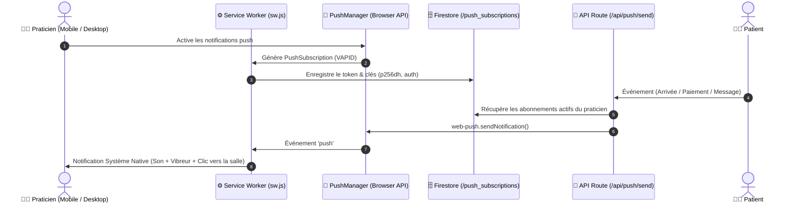

# Spécification Technique - Notifications Web Push PWA & Alertes Système

## 1. Contexte & Objectif
L'application **TéléMed Sénégal v2** est une Progressive Web App (PWA) médicale permettant aux praticiens de consulter à distance et de suivre leurs patients. Pour garantir une réactivité optimale et ne manquer aucun patient lorsque le praticien n'a pas son navigateur ouvert au premier plan, cette spécification définit le sous-système universel de **Notifications Web Push PWA (W3C standard VAPID)**.

### Objectifs Clés
1. **Alerte Système Instantanée :** Notifier le médecin sur son smartphone (iOS 16.4+ PWA / Android) et ordinateur même si l'onglet est fermé ou en arrière-plan.
2. **Événements Couverts :**
   - 🚨 **Arrivée Patient :** Entrée d'un nouveau patient dans la file d'attente.
   - 💳 **Paiement Déclaré :** Déclaration de paiement (Wave ou Orange Money) en attente de confirmation.
   - 💬 **Nouveau Message / Vocal :** Réception d'un message texte ou d'une note vocale dans une consultation active.
3. **Multi-Terminaux & Haute Tolérance aux Pannes :** Envoi simultané sur tous les appareils enregistrés du praticien avec nettoyage automatique des abonnements expirés/révoqués.
4. **Zéro Régression & Zéro Blocage :** Tous les envois push sont non-bloquants et asynchrones pour préserver la réactivité de l'application.

---

## 2. Architecture & Composants

### 2.1 Schéma Fonctionnel


---

## 3. Détail des Composants Techniques

### 3.1 Service Worker (`public/sw.js`)
- **Événement `push` :**
  - Récupère le payload JSON chiffré : `{ title, body, icon, badge, url, tag, vibrate }`.
  - Exécute `self.registration.showNotification(title, options)`.
  - Options par défaut :
    - `icon`: `/icons/icon-192.svg`
    - `badge`: `/icons/icon-192.svg`
    - `vibrate`: `[200, 100, 200]`
    - `data`: `{ url: url || '/dashboard' }`
- **Événement `notificationclick` :**
  - Ferme la notification avec `event.notification.close()`.
  - Cible l'onglet existant de l'application si disponible ou ouvre une nouvelle fenêtre via `clients.openWindow(url)`.

### 3.2 Utilitaire Client (`lib/utils/pushNotification.ts`)
- **Vérification de support :** Vérifie la présence de `Notification`, `serviceWorker` et `PushManager`.
- **Méthode `subscribeDoctorToPush(doctorSlug: string)` :**
  1. Demande l'autorisation via `Notification.requestPermission()`.
  2. Récupère le `registration.pushManager`.
  3. Effectue la souscription avec la clé publique VAPID (`applicationServerKey`).
  4. Enregistre la souscription dans la collection Firestore `push_subscriptions` :
     ```typescript
     interface PushSubscriptionRecord {
       id: string; // Hash ou doc id
       doctorSlug: string;
       endpoint: string;
       keys: {
         p256dh: string;
         auth: string;
       };
       userAgent: string;
       createdAt: string;
       updatedAt: string;
     }
     ```
- **Méthode `unsubscribeDoctorFromPush(doctorSlug: string)` :** Désactive la souscription locale et supprime l'enregistrement Firestore.
- **Méthode `getPushSubscriptionStatus(doctorSlug: string)` :** Retourne `'granted' | 'denied' | 'default' | 'unsupported'`.

### 3.3 Route API Backend (`app/api/push/send/route.ts`)
- **Dépendance :** Librairie `web-push`.
- **Sécurité VAPID :**
  - `NEXT_PUBLIC_VAPID_PUBLIC_KEY`
  - `VAPID_PRIVATE_KEY`
  - `VAPID_SUBJECT` (mailto: contact@telemed.sn)
- **Traitement :**
  - Reçoit un payload `{ doctorSlug, title, body, url, tag }`.
  - Récupère toutes les souscriptions liées à `doctorSlug`.
  - Envoie en parallèle via `Promise.allSettled()`.
  - Supprime automatiquement de Firestore les souscriptions dont le statut HTTP est `404 Not Found` ou `410 Gone`.

### 3.4 Déclencheurs dans les Services Métier (`lib/services/doctorService.ts`)
- **Arrivée Patient (`addPatientToQueue`) :**
  - Titre : `🚨 Nouveau Patient en Attente`
  - Message : `{patientName} est en salle d'attente pour : {reason}`
  - URL : `/dashboard`
- **Paiement Déclaré :**
  - Titre : `💳 Paiement Reçu / Déclaré`
  - Message : `{patientName} a déclaré son paiement de {fee} FCFA via {Wave/OM}`
  - URL : `/dashboard`
- **Message Patient (`sendConsultationMessage`) :**
  - Si `sender === 'patient'` :
  - Titre : `💬 Message de {patientName}`
  - Message : Note vocale ou aperçu du texte
  - URL : `/consultation/{patientId}`

### 3.5 Interface Utilisateur (`components/doctor/DoctorDashboard.tsx`)
- Ajout d'un bouton d'activation discret et moderne dans la barre d'outils supérieure du praticien :
  - `[🔔 Notifications Push : Activées]` (pastille verte)
  - `[🔕 Activer les alertes sur ce téléphone / PC]` (clic déclencheur de permission)

---

## 4. Gestion des Clés VAPID
Les clés VAPID standardisées sont générées une seule fois et configurées de manière sécurisée :
- Clé Publique (accessible côté client pour la souscription du PushManager).
- Clé Privée (côté serveur uniquement pour la signature des requêtes push vers les serveurs Apple/Google/Mozilla).

---

## 5. Critères de Validation & Tests
1. **Autorisation :** La demande de permission s'affiche au clic du praticien et met à jour l'indicateur d'état.
2. **Persistance :** Le token est correctement stocké dans Firestore sous `push_subscriptions`.
3. **Expédition :** L'API `/api/push/send` délivre la notification sans erreur et nettoie les abonnements invalides.
4. **Réception :** Le Service Worker reçoit l'événement `push` et affiche la bannière système avec l'icône TéléMed.
5. **Redirection :** Le clic sur la notification ouvre directement le Dashboard ou la consultation concernée.
