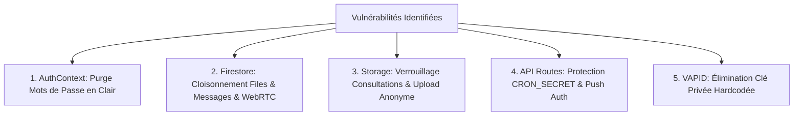

# Spécification Technique : Durcissement Prioritaire de la Sécurité (Phase 1)

**Date :** 18 Septembre 2026  
**Statut :** Validé  
**Plateforme :** TELEMED SENEGAL V2 (`www.telemedsenegal.com`)  
**Conformité :** CDP Sénégal (Loi 2008-12), Secret Médical (ONMS), HDS  

---

## 1. Contexte & Objectif

L'audit de sécurité a identifié des vulnérabilités critiques dans les règles Cloud Firestore, Cloud Storage, la gestion de l'authentification administrative et les routes API publiques.

L'objectif de cette Phase 1 est de neutraliser immédiatement tous les vecteurs de fuite de données de santé et de compromission administrative sans altérer l'expérience utilisateur et médicale.

---

## 2. Périmètre des Interventions

### 🔹 1. Authentification & Sessions (`lib/context/AuthContext.tsx`)
- Suppression totale des vérifications de mot de passe en clair (`Aminata2025`, `admin123`, `password123`).
- Authentification exclusive via Firebase Authentication (`signInWithEmailAndPassword`) avec gestion d'erreurs robuste.
- Interdiction de déverrouillage de session Super-Admin sans authentification Firebase Auth confirmée.

### 🔹 2. Règles Firestore (`firestore.rules`)
- **`patient_queues/{patientId}` :**
  - `allow create: if true;` (inscription patient préservée).
  - `allow get: if true;` (lecture du ticket unique par son identifiant connu par le patient ou médecin).
  - `allow list: if isAuthenticated();` (interdiction formelle de scanner ou lister tous les dossiers patients anonymement).
  - `allow update: if isAuthenticated() || isAdmin();` (mises à jour cliniques protégées).
- **`patient_queues/{patientId}/messages/{messageId}` :**
  - Lecture et écriture restreintes aux participants authentifiés ou détenteurs du dossier.
- **`webrtc_sessions/{sessionId}` :**
  - Lecture et écriture restreintes pour éviter le détournement de sessions visio.
- **`push_subscriptions/{subId}` :**
  - Lecture/écriture restreinte au praticien titulaire ou admin.
- **`isAdmin()` :**
  - Exigence de `request.auth.token.email_verified == true`.

### 🔹 3. Règles Cloud Storage (`storage.rules`)
- **`/consultations/{consultationId}/{allPaths=**}` :**
  - Lecture réservée aux utilisateurs authentifiés (`request.auth != null`) ou admin.
  - Écriture protégée avec vérification de type MIME et taille < 15 Mo.
- **`/{allPaths=**}` :**
  - Suppression de la lecture publique globale (`allow read: if false;` par défaut sauf dossiers autorisés).

### 🔹 4. Routes API (`app/api/`)
- **`app/api/cron/retention/route.ts` :**
  - Contrôle systématique de l'en-tête `Authorization: Bearer <CRON_SECRET>`.
- **`app/api/push/send/route.ts` :**
  - Contrôle d'authentification ou clé secrète d'appel interne.

### 🔹 5. Gestion des Clés VAPID (`lib/config/vapid.ts`)
- Élimination de la clé privée fallback inscrite en clair.

---

## 3. Critères d'Acceptation & Tests
1. **Compilation & Linting :** `npx tsc --noEmit` avec 0 erreur.
2. **Test Anti-Bypass Admin :** Impossible d'obtenir le statut admin sans mot de passe vérifié par Firebase Auth.
3. **Test Confidentialité Firestore & Storage :** Les requêtes anonymes non ciblées sur les collections sensibles sont rejetées.
4. **Test Protection API :** Les requêtes sans jeton d'autorisation sur `/api/cron/retention` renvoient HTTP 401 Unauthorized.
5. **Non-régression fonctionnelle :** Parcours patient, délivrance d'ordonnance, téléconsultation et dashboard médecin 100% opérationnels.
